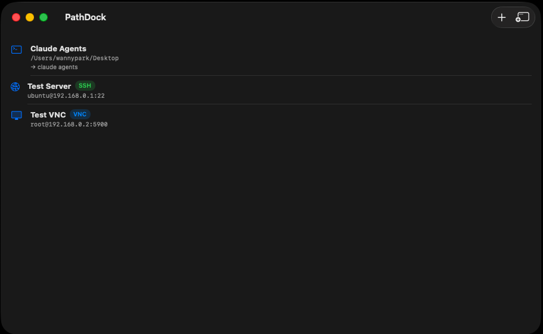
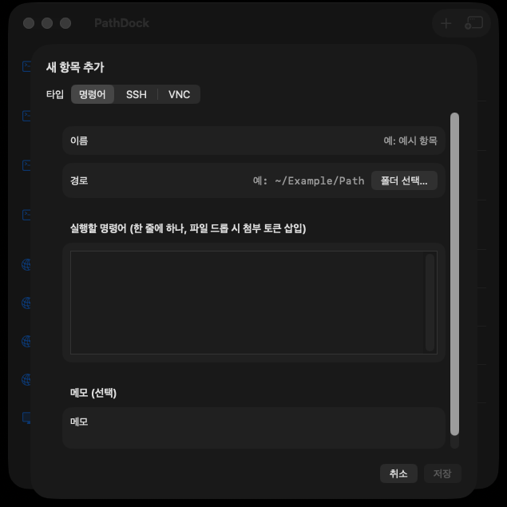
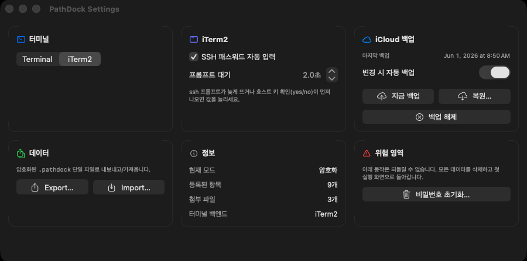
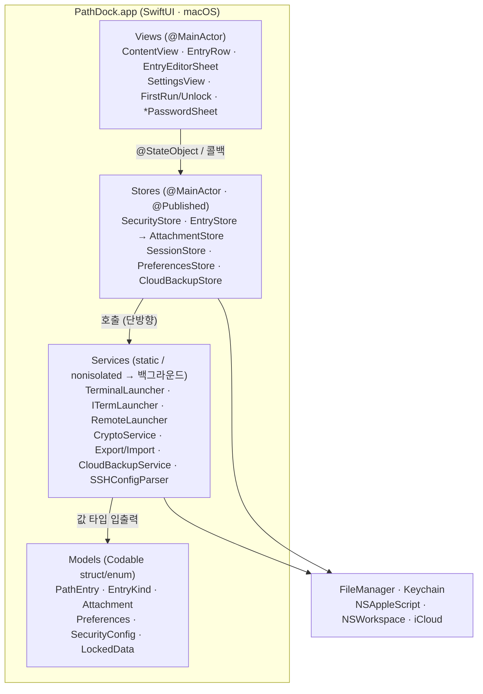
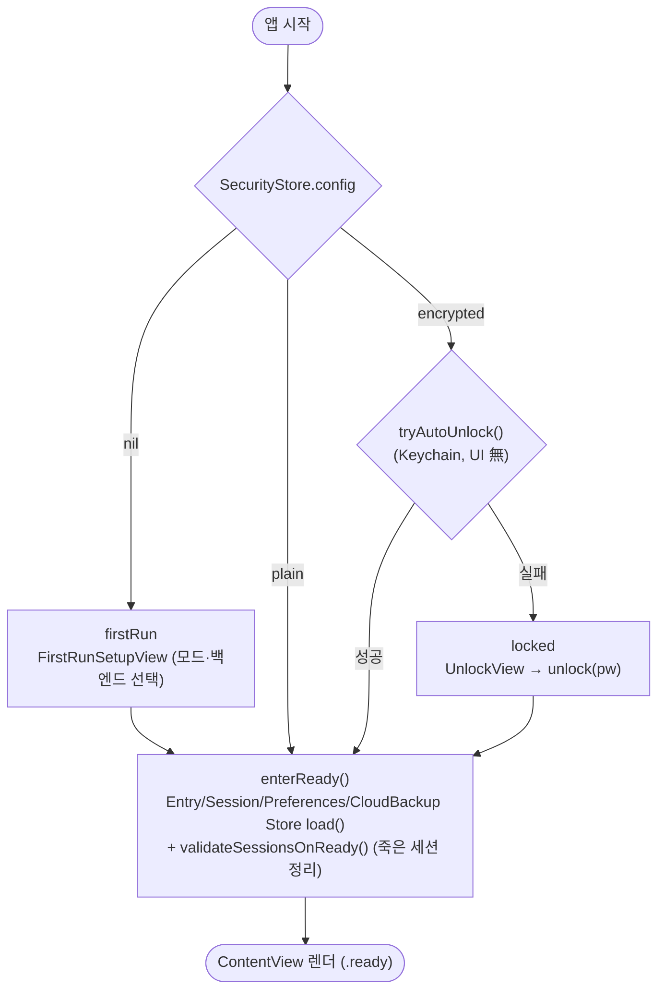
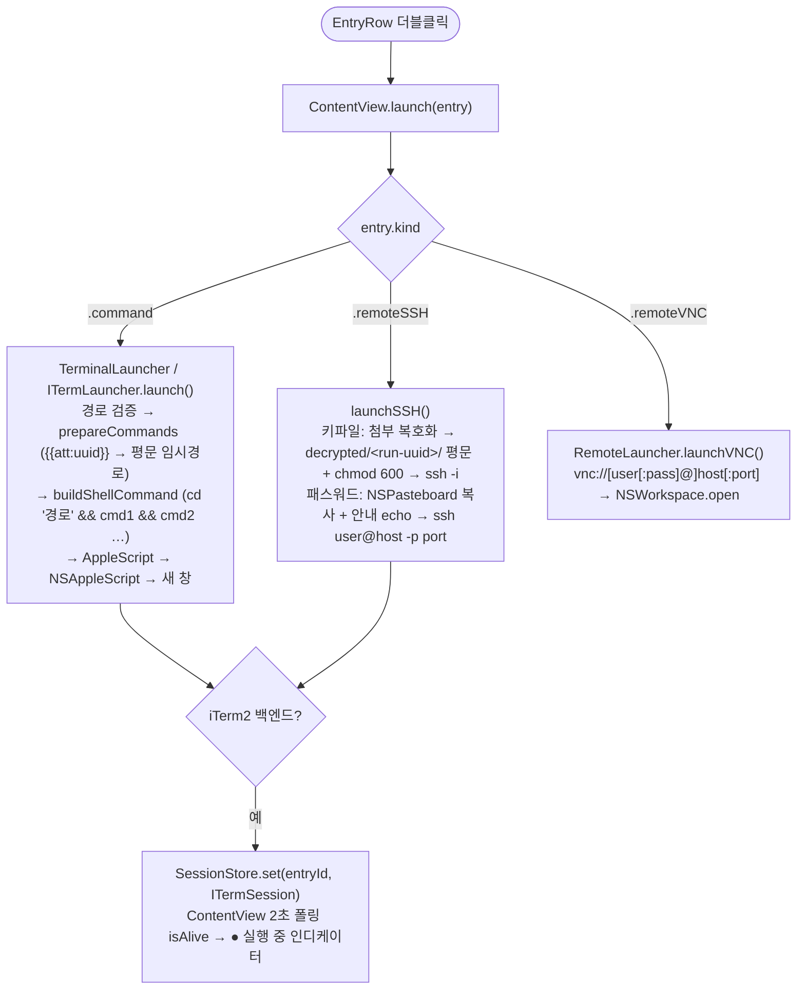
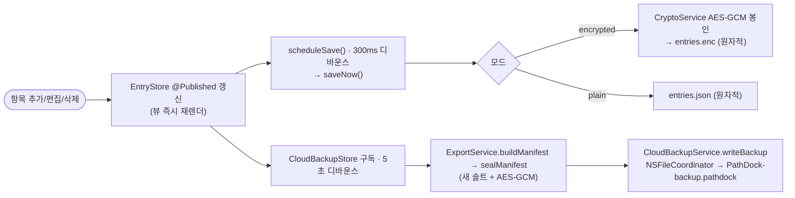

# PathDock

자주 사용하는 작업 디렉토리·SSH·VNC 연결을 등록해두고 **더블클릭** 한 번으로 새 터미널 창을 띄우는 macOS 런처.



> macOS 13+ · Swift / SwiftUI · Developer ID 서명·공증 · Sparkle 자동 업데이트 · 개인/사내용 (App Sandbox OFF, Mac App Store 미배포)

## 한눈에

| | |
|---|---|
|  |  |
| **타입별 입력 폼** — 명령어 / SSH / VNC | **설정** — 터미널 백엔드 / 암호화 / iCloud 백업 |

> 위 스크린샷 파일은 `docs/screenshots/` 디렉토리에 있는 파일을 참조한다. 빈 상태로 보이면 같은 이름으로 캡처해 넣어두면 자동으로 노출된다.

## 다운로드 / 설치

[**📦 GitHub Releases**](https://github.com/manaes/PathDock/releases/latest) 페이지에서 최신 `PathDock-x.y.z.zip` 을 받는다.

1. 다운로드한 zip 을 풀어 `PathDock.app` 을 `/Applications` 폴더로 드래그
2. 첫 실행 다이얼로그에서 **암호화 활성화 / 암호화하지 않기** + **터미널 백엔드(Terminal/iTerm2)** 선택

macOS 빌드는 Apple **Developer ID 로 서명·공증(notarization)** 되어 별도 Gatekeeper 우회 없이 더블클릭으로 바로 실행된다.

### 자동 업데이트

앱에 [Sparkle](https://sparkle-project.org) 자동 업데이트가 내장되어 있다. 새 버전이 릴리즈되면 실행 중 자동으로 확인하며, 메뉴 **PathDock → 업데이트 확인…** 으로 수동 확인도 가능하다. 업데이트 패키지는 EdDSA 키로 서명되어 검증 후 설치된다.

> **iCloud 백업 안내** — 배포(서명·공증) 빌드에는 iCloud 백업이 포함되지 않는다. 관리형 iCloud entitlement 은 프로비저닝 프로파일을 요구하므로 배포 빌드에서 제외했다(설정의 iCloud 백업은 본인 Apple 계정으로 Xcode 에서 직접 빌드·실행할 때만 동작). 암호화 단일 파일(`.pathdock`) Export/Import 백업은 배포 빌드에서도 그대로 사용할 수 있다.

소스에서 직접 빌드하려면 아래 [빌드 및 실행](#빌드-및-실행) 참고. CI 상태:

[](https://github.com/manaes/PathDock/actions/workflows/ci.yml)
[](https://github.com/manaes/PathDock/actions/workflows/release.yml)

## 주요 기능

- **두 가지 항목 타입**: 명령어 / 원격연결(SSH·VNC) — 추가 시트 상단 Picker 에서 선택
- 리스트에서 타입별 아이콘 + 뱃지(SSH=초록, VNC=파랑) 구분
- 컨텍스트 메뉴: 편집 / 실행 / 복제 / 위/아래 이동 / 삭제
- 드래그&드롭으로 순서 변경
- 우측상단 "새 터미널" 버튼 — 빈 Terminal 새 창 열기

### 명령어 타입
- 경로 + 이름 + **진입 직후 실행할 명령어셋** 을 묶어 저장
- 더블클릭 → Terminal.app 새 창에서 `cd '경로' && cmd1 && cmd2 ...` 실행
- 명령어가 비어 있으면 `cd` 까지만 수행
- 작은따옴표/공백이 포함된 경로도 안전하게 escape

### 원격연결 타입 (SSH / VNC)
- 공통 필드: 이름 / 주소 / 포트 / 사용자명 / 메모
- **SSH**: 인증 방식 선택 — 키파일(첨부 시스템에 저장, 실행 시 평문 임시 + chmod 600) 또는 패스워드
  - 더블클릭 → Terminal 새 창에서 `ssh user@host -p port [-i keyfile]`
  - 패스워드 모드는 자동입력이 표준 ssh 에서 불가하므로, **패스워드를 클립보드에 자동 복사** + 안내 echo 가 ssh 앞에 붙음 (사용자는 프롬프트에서 ⌘V)
  - **`~/.ssh/config` 자동 인식**: 시트 최상단 "ssh config" 버튼 → 등록된 Host 를 선택하면 항목 이름·HostName·Port·User·IdentityFile 이 폼에 채워짐. IdentityFile 은 PathDock 첨부 시스템으로 자동 import (10MB 상한, 암호화 모드면 자동 암호화). 와일드카드(`Host *`) / `Match` / `Include` 는 제외
  - **추가 옵션**: SSH 폼의 "추가 옵션" 섹션에 한 줄에 하나씩 `Key Value` 형식으로 입력하면 실행 시 `-oKey=Value` 로 변환되어 ssh 인자에 합성. ssh config 에서 가져올 때 PathDock 이 매핑하지 않는 키들(`HostKeyAlgorithms`, `PubkeyAcceptedAlgorithms`, `ServerAliveInterval` 등)이 여기로 자동 채워짐 → 레거시 호스트 키 호환 등 해결에 사용
- **VNC**: 패스워드 옵션만
  - 더블클릭 → `open "vnc://[user[:pass]@]host[:port]"` 로 macOS 화면 공유 / 등록된 vnc 핸들러 호출
  - 사용자명/패스워드는 percent-encoding 으로 안전하게 escape
- **명령어에 파일 첨부**: 명령어 입력 영역에 파일을 끌어다 놓으면 커서 위치에 `{{att:<uuid>}}` 토큰이 삽입되고, 실행 시 평문 임시 파일 경로로 치환된다 (단일 파일 최대 10MB)
- **저장 데이터 암호화 (선택)**: AES-GCM-256 + PBKDF2-SHA256(600k iter) + per-file nonce + 마스터키 검증 토큰. Keychain 에 마스터키를 저장해 매번 비밀번호를 묻지 않음
- **첫 실행 다이얼로그**: "암호화 활성화" 또는 "암호화하지 않기" 중 선택. 한 번 정한 모드는 고정
- **메뉴 → 설정**: 비밀번호 초기화(전체 데이터 폐기) / Export / Import(`.pathdock` 단일 파일)

## 동작 원리

### 1. 시스템 토폴로지

`Views → Stores → Services → Models → 영속화 API` 의 단방향 4계층 구조이며, 순환 의존이 없다.



**의존 방향 원칙**
- 위→아래 단방향. Service 는 Store 를 참조하지 않는다(stateless).
- Store·View 는 `@MainActor` 로 메인 스레드 보장, Service 는 `nonisolated` 라 KDF/암복호화/첨부 복사를 백그라운드 Task 에서 수행한다.
- Model 은 모두 불변 `Codable` 값 타입이라 어느 계층에서나 안전하게 주고받는다.

### 2. 시작 → 상태 결정

`PathDockApp` 가 상태머신(`AppPhase`: firstRun / locked / ready)으로 분기한다.



### 3. 항목 더블클릭 → 터미널 실행



### 4. 저장 · iCloud 자동 백업

EntryStore 변경은 `@Published` 로 즉시 뷰에 반영되고, **300ms 디바운스 저장**과 **5초 디바운스 백업**이 각각 분리되어 동작한다.



복원은 역방향으로 `ImportService.decodeManifest` → `apply(merge|replace)` 이며, 모든 첨부 id·`{{att:uuid}}` 토큰·SSH 키 참조를 새 id 로 remap 한다.

## 요구 사항

- macOS 13 Ventura 이상
- Xcode 15+
- Swift 5.0+

## 빌드 및 실행

### Xcode 에서

1. `9_PathDock/PathDock.xcodeproj` 더블클릭
2. 스킴 `PathDock` 선택 후 `⌘R`

### 커맨드라인

```bash
cd path/to/9_PathDock
xcodebuild -project PathDock.xcodeproj -scheme PathDock -configuration Debug build
```

빌드 산출물은 `~/Library/Developer/Xcode/DerivedData/.../Build/Products/Debug/PathDock.app` 에 생성된다. 더블클릭 또는 `open ./PathDock.app` 로 실행.

### 릴리즈 (배포)

`v*` 태그를 푸시하면 [release 워크플로우](.github/workflows/release.yml)가 자동으로 **archive → exportArchive(developer-id) → 공증 → Sparkle 서명 → GitHub Release 첨부**까지 수행한다.

```bash
git tag v1.0.3
git push origin v1.0.3
```

저장소 Settings → Secrets 에 다음 7개가 필요하다(미설정 시 서명·공증·appcast 단계가 실패한다).

| 시크릿 | 내용 |
|---|---|
| `APPLE_CERTIFICATE` | Developer ID Application 인증서(.p12)를 base64 인코딩한 값 |
| `APPLE_CERTIFICATE_PASSWORD` | 위 `.p12` 의 비밀번호 |
| `APPLE_SIGNING_IDENTITY` | 예: `Developer ID Application: 이름 (XXXXXXXXXX)` |
| `APPLE_ID` | Apple 계정 이메일 |
| `APPLE_PASSWORD` | 앱 암호(app-specific password, `xxxx-xxxx-xxxx-xxxx`) |
| `APPLE_TEAM_ID` | Developer ID 인증서의 팀 ID |
| `SPARKLE_ED_PRIVATE_KEY` | Sparkle EdDSA 개인키(`generate_keys -x` 로 내보낸 값). 공개키는 `Info.plist` 의 `SUPublicEDKey` 에 포함 |

## 첫 실행 시 자동화 권한

PathDock 은 Terminal.app 을 AppleScript 로 제어한다. 첫 실행 시 macOS 가 다음 권한을 요청한다.

> "PathDock"이(가) "Terminal" 앱을 제어하도록 허용하시겠습니까?

**허용** 을 눌러야 정상 동작한다. 거부한 경우 시스템 설정에서 다시 켤 수 있다.

```
시스템 설정 → 개인 정보 보호 및 보안 → 자동화 → PathDock → Terminal 체크
```

## 데이터 저장 위치

```
~/Library/Application Support/PathDock/
├── security.plist     # 모드(plain|encrypted) + 솔트 + verifier
├── entries.json       # plain 모드: 평문 JSON
├── entries.enc        # encrypted 모드: { nonce, tag, ciphertext }
├── preferences.json   # 백엔드/토글 등 평문 환경설정 (민감값 없음)
├── sessions.json|.enc # iTerm2 세션 매핑 (모드에 따라)
├── attachments/<uuid> # 첨부 파일 (모드에 따라 평문 / nonce|ct|tag)
└── decrypted/         # 실행 시 평문 임시 (다음 앱 시작 시 1회 정리)

~/Library/Mobile Documents/iCloud~com~wannypark~pathdock/Documents/
└── PathDock-backup.pathdock   # iCloud 백업 (암호화된 .pathdock)
```

- **plain 모드**: 직접 편집 가능. 단, 앱 실행 중엔 디바운스 저장에 덮어쓰일 수 있으니 앱 종료 후 수정.
- **encrypted 모드**: Keychain 항목 `com.wannypark.pathdock.masterkey` (account: `default`, AccessibleWhenUnlockedThisDeviceOnly).
- **iCloud 백업 비밀번호**: Keychain 항목 `com.wannypark.pathdock.backuppw` (account: `default`).

## 터미널 백엔드 (Terminal / iTerm2)

PathDock 은 두 가지 터미널 백엔드를 지원한다.

| 백엔드 | 세션 추적 | 패스워드 자동 입력 | 비고 |
|---|---|---|---|
| **Terminal.app** | X (매번 새 창) | 클립보드 복사 + 안내 echo | macOS 기본, 자동화 권한 |
| **iTerm2** | O — 세션 살아있으면 더블클릭 시 활성화 | AppleScript `write text` 로 자동 (기본 ON, delay 2초) | 별도 설치 필요 |

- 첫 실행 다이얼로그 또는 메뉴 → 설정 → 터미널 에서 선택
- iTerm2 미설치 상태로 선택 시도 → "설치하기" 버튼 알럿 (`https://iterm2.com/` 으로 이동)
- 백엔드 변경 시 기존 세션 매핑은 폐기됨
- iTerm2 모드에서만 리스트 행에 **● 실행 중** 인디케이터 표시 (2초 폴링, 윈도우 비활성 시 정지)
- 우클릭 메뉴: "실행" (활성화 우선) / "새 세션으로 실행" / "세션 종료" (살아있을 때만)

## 보안 / 첫 실행

첫 실행 시 다이얼로그에서 다음 중 하나를 선택한다.

| 선택 | 동작 |
|---|---|
| 암호화 활성화 | 입력한 암호 → PBKDF2-SHA256 (600,000 iter) → AES-256 키 도출 → Keychain 저장. entries 와 첨부가 AES-GCM 으로 암호화되어 디스크에 저장됨 |
| 암호화하지 않기 | 모든 IO 가 평문. UX 동일 |

**한 번 정한 모드는 고정.** 변경하려면 메뉴 → 설정 → **비밀번호 초기화** (전체 데이터 폐기) 후 첫 실행 다이얼로그로 복귀.

### Export / Import (`.pathdock` 단일 파일)

- **Export**: 별도 비밀번호 입력 → entries + 첨부 전체를 단일 `.pathdock` 파일로 패키징
- **Import**: 파일 선택 → 그 파일의 비밀번호 입력 → 복호화 → **현재 마스터키로 재암호화하여 기존 리스트에 병합(append)**
- 파일 포맷: `magic(8) + version(2) + salt(16) + nonce(12) + ciphertext + tag(16)` (외부 의존 없는 자체 정의)

### iCloud 백업 / 복원

전용 iCloud 컨테이너(`iCloud.com.wannypark.pathdock`)의 `Documents/PathDock-backup.pathdock` 에 **암호화된 백업**을 올리고, 다른 기기에서 복원한다. 백업 파일은 Export 와 동일한 `.pathdock`(AES-GCM) 포맷이므로 **iCloud 에는 암호화된 바이트만 올라가며**, 백업 비밀번호 없이는 열 수 없다.

- **설정**: 메뉴 → 설정 → iCloud 백업 → "iCloud 백업 설정…" 에서 백업 비밀번호 1회 지정 → Keychain 에 저장 → 이후 **원탭 백업/복원** (앱 비밀번호와 무관)
- **자동 백업**: 항목/첨부가 바뀌면 5초 디바운스로 iCloud 에 자동 백업. 설정에서 토글 가능
- **수동 백업**: "지금 백업" 버튼
- **복원**: "iCloud 에서 복원…" → **덮어쓰기(현재 목록 교체)** 또는 **병합(기존 + 백업)** 선택. 첨부는 현재 마스터키로 재암호화되고 id·토큰·SSH 키파일 참조가 새 id 로 remap 된다
- iCloud 미로그인/미설정이면 섹션이 "사용 불가"로 표시되고 버튼이 비활성화된다 (우아한 비활성화)
- 백업 비밀번호는 Keychain `com.wannypark.pathdock.backuppw` (account `default`)에 저장된다. **비밀번호 초기화** 시 함께 삭제된다

> **빌드 시 1회 설정 필요**: iCloud 컨테이너는 엔타이틀먼트(`PathDock.entitlements`)와 Info.plist(`NSUbiquitousContainers`)에 이미 선언돼 있다. Xcode 에서 본인 계정으로 처음 빌드/서명할 때 **Signing & Capabilities → + Capability → iCloud → iCloud Documents** 를 켜고 컨테이너 `iCloud.com.wannypark.pathdock` 를 체크해야 프로비저닝 프로파일에 반영된다. (자동 서명이면 Xcode 가 대부분 자동 등록한다)

### 첨부

- 명령어 입력 영역에 파일을 끌어다 놓으면 커서 위치에 `{{att:<uuid>}}` 토큰이 삽입된다
- 단일 파일 **10MB 상한** (초과 시 첨부 거부 알럿)
- 실행 시 평문이 `decrypted/<run-uuid>/<originalName>` 에 잠시 풀려 명령어에 셸 escape 된 경로로 치환된 뒤, Terminal 창에서 실행
- 평문 임시 파일은 **다음 앱 시작 시 1회** 자동 정리

## 사용 예시

| 이름 | 경로 | 명령어셋 |
|---|---|---|
| Example Project | `~/Example/Path` | `bundle install`<br>`bundle exec fastlane test` |
| Plain cd | `~/Example/Another` | (비워둠 → cd 만) |
| Log Tail | `/var/log/example` | `tail -f main.log` |

> 명령어셋은 한 줄에 하나의 명령으로 입력한다. 빈 줄은 무시된다. 줄 단위로 `&&` 로 묶여 셸에 전달된다.

## 폴더 구조

```
9_PathDock/
├── README.md
├── PathDock.xcodeproj/
├── Tests/run_unit_tests.swift   # standalone 단위 회귀 (swift Tests/run_unit_tests.swift)
└── PathDock/
    ├── PathDockApp.swift              # @main, 상태머신 (firstRun / locked / ready)
    ├── Models/
    │   ├── PathEntry.swift            # attachments 필드 포함
    │   ├── Attachment.swift
    │   └── SecurityConfig.swift
    ├── Stores/
    │   ├── EntryStore.swift           # entries.json ↔ entries.enc 모드 분기 (깊은 복제/전체 폐기 포함)
    │   ├── AttachmentStore.swift      # 10MB 상한, 모드별 IO, decrypted cleanup
    │   ├── SecurityStore.swift        # security.plist + Keychain + KDF(백그라운드) + verifier + 백업 비번
    │   └── CloudBackupStore.swift     # iCloud 백업/복원 코디네이터 (자동 백업 디바운스)
    ├── Services/
    │   ├── TerminalLauncher.swift     # AppleScript + 토큰 치환
    │   ├── CryptoService.swift        # AES-GCM + PBKDF2 + LockedData(mlock)
    │   ├── ExportService.swift        # .pathdock 패키지 생성 (manifest 구성 / 봉인 분리)
    │   ├── ImportService.swift        # .pathdock 복호화 → 재암호화 → 병합/덮어쓰기
    │   └── CloudBackupService.swift   # iCloud ubiquity 컨테이너 파일 IO (조율/다운로드)
    ├── Views/
    │   ├── ContentView.swift
    │   ├── EntryRow.swift
    │   ├── EntryEditorSheet.swift
    │   ├── DraggableCommandEditor.swift  # NSTextView + fileURL drop
    │   ├── FirstRunSetupView.swift
    │   ├── UnlockView.swift
    │   ├── SettingsView.swift            # 비번 초기화 / Export / Import / iCloud 백업
    │   ├── ExportPasswordSheet.swift
    │   ├── ImportPasswordSheet.swift
    │   └── CloudBackupPasswordSheet.swift
    ├── Resources/
    │   ├── Info.plist
    │   └── PathDock.entitlements
    └── Assets.xcassets/
```

## 알려진 한계

- 메뉴바 상주 모드 / 글로벌 단축키 미지원
- 명령어 실행 결과 캡처 안 함 (Terminal 창에 그대로 보임)
- iTerm2 SSH 패스워드 자동 입력은 고정 delay 휴리스틱(설정에서 조정 가능). 호스트 키 최초 확인(yes/no) 프롬프트가 먼저 뜨면 어긋날 수 있음
- iCloud 백업은 단일 캐노니컬 파일(덮어쓰기)이며 버전 히스토리는 보관하지 않음. 동시 다중 기기 편집 충돌 병합은 하지 않음(마지막 백업이 우선)

## 최근 업데이트

| 일자 | 요약 |
|---|---|
| 2026-06-05 | **Developer ID 서명·공증(notarization)** 적용 · **Sparkle 자동 업데이트** 내장(서명된 appcast) · `v*` 태그 푸시 시 archive→exportArchive(developer-id)→공증→릴리즈 자동화 |
| 2026-06-something | 설정 화면을 카드 그리드로 재구성 · 폭에 따라 1~3 컬럼 자동 적응 · 같은 행 카드 높이 자동 통일 · 위험 영역 카드 분리 |
| 2026-05-30 | **iCloud 백업/복원** 추가 (전용 컨테이너, 원탭 + 자동) · 복제·Import 시 SSH/VNC 정보 누락 버그 수정 · PBKDF2 백그라운드 오프로딩 · iTerm2 자동 입력 대기 시간 설정화 |
| 2026-05-27 | SwiftUI 뷰 평가 도중 `NSAppleScript` 동기 실행으로 인한 재진입 SIGABRT 크래시 수정 |
| 2026-05-26 | iTerm2 세션 검사 일괄 조회 · SSH 패스워드 전달 백엔드별 캡슐화 |

자세한 내용은 `git log` 를 참고하라.

## 라이선스

(배포 시 결정) — 사내/개인용으로만 사용한다면 라이선스 미명시도 무방하지만, 공개 배포한다면 `MIT` / `Apache-2.0` / `Proprietary` 중 하나를 명시하는 것을 권장한다.

## 문의 / 이슈

- 깃허브 저장소: [`manaes/PathDock`](https://github.com/manaes/PathDock)
- 버그 리포트·기능 제안은 위 저장소의 Issues 로
